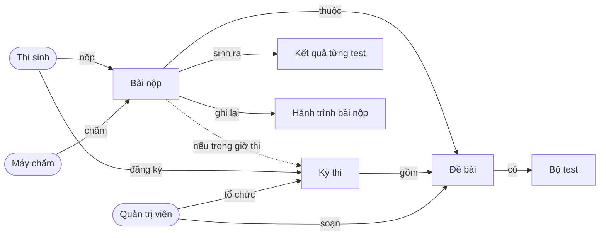
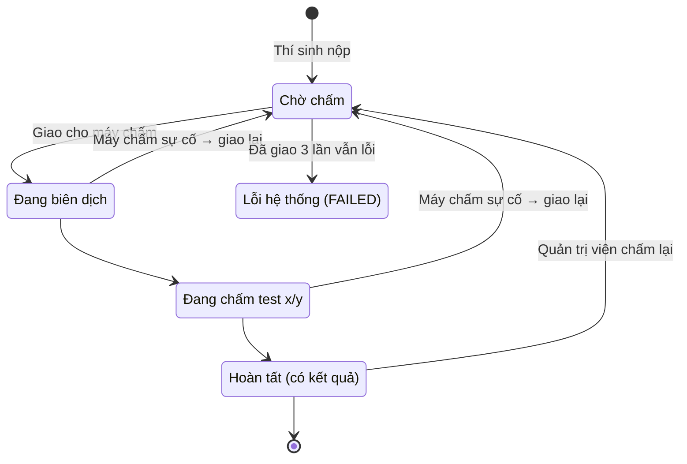

# Phân tích dữ liệu theo nghiệp vụ – CodeJudge

Tài liệu này mô tả từng bảng dữ liệu bằng ngôn ngữ nghiệp vụ: bảng ghi lại điều gì ngoài đời
thực, ai tạo ra, khi nào thay đổi, và hệ thống áp những quy tắc nào. Chi tiết kỹ thuật (kiểu
cột, chỉ mục, view) xem ở [`database.md`](database.md).

## 1. Bức tranh chung

Hệ thống phục vụ một việc: **thí sinh nộp lời giải C++, máy chấm tự động cho kết quả**, trong
hai bối cảnh là **luyện tập tự do** và **kỳ thi có giờ giấc**.

| Tác nhân | Vai trò nghiệp vụ |
| --- | --- |
| **Thí sinh** | Sinh viên, đăng nhập bằng MSSV + họ tên. Đọc đề, nộp bài, xem kết quả, đăng ký và dự thi. |
| **Quản trị viên** (giảng viên) | Soạn đề và bộ test, tổ chức kỳ thi, theo dõi máy chấm, tra cứu bài nộp, chấm lại. |
| **Máy chủ điều phối** (Master) | Nhận bài, xếp hàng, giao cho máy chấm, ghi kết quả, giao lại bài khi máy chấm gặp sự cố. |
| **Máy chấm** (Worker) | Biên dịch và chạy bài trên từng test, báo tiến độ và kết quả về Master. |

12 bảng chia thành 5 nhóm nghiệp vụ:

| Nhóm | Bảng | Câu hỏi nghiệp vụ mà nhóm trả lời |
| --- | --- | --- |
| Con người | `users`, `sessions` | Ai đang dùng hệ thống, với quyền gì? |
| Ngân hàng đề | `problems`, `test_cases` | Có những bài nào, chấm đúng sai dựa vào đâu? |
| Kỳ thi | `contests`, `contest_problems`, `contest_participants` | Thi khi nào, thi bài gì, ai được thi? |
| Chấm bài | `submissions`, `submission_test_results`, `submission_events` | Ai nộp gì, kết quả ra sao, bài đã đi qua những bước nào? |
| Vận hành | `workers`, `system_logs` | Máy chấm nào đang chạy, hệ thống đã xảy ra chuyện gì? |

## 2. Nhóm Con người

### 2.1 `users` – Người dùng

**Là gì:** mỗi dòng là một con người dùng hệ thống, hoặc là thí sinh, hoặc là quản trị viên.

| Thông tin | Ý nghĩa nghiệp vụ |
| --- | --- |
| Tên đăng nhập | Với thí sinh là **MSSV** (vd. `B20DCCN001`), luôn viết hoa. Đây là "danh tính" xuất hiện trên bảng xếp hạng. |
| Họ tên | Tên hiển thị trên bảng xếp hạng và danh sách bài nộp. |
| Vai trò | Thí sinh hoặc Quản trị viên. |
| Mật khẩu | Chỉ quản trị viên có. Thí sinh không có mật khẩu. |
| Lần đăng nhập cuối | Phục vụ thống kê và theo dõi. |

**Khi nào sinh ra:** thí sinh được tạo **tự động ở lần đăng nhập đầu tiên** bằng MSSV + họ tên.
Tài khoản quản trị được tạo sẵn khi cài đặt hệ thống.

**Quy tắc:**
- Mỗi MSSV chỉ có một tài khoản, không phân biệt chữ hoa/thường khi đăng nhập.
- MSSV phải đúng định dạng của trường: 1 chữ, 2 số, 4 chữ, 3 số.
- Quản trị viên bắt buộc có mật khẩu.

### 2.2 `sessions` – Phiên đăng nhập

**Là gì:** một lần người dùng đăng nhập trên một thiết bị, giống "vé vào cửa" có hạn dùng.

**Khi nào sinh ra / kết thúc:** sinh ra khi đăng nhập. Kết thúc khi hết hạn, hoặc khi người dùng
đăng xuất / bị thu hồi. Một người có thể có nhiều phiên cùng lúc (máy lab, máy cá nhân).

**Quy tắc:** hệ thống không lưu bản gốc của "vé", chỉ lưu dấu vân tay của nó. Ai đọc trộm được
dữ liệu cũng không dùng được để đăng nhập. Có lưu địa chỉ IP và trình duyệt để tra soát khi cần.

## 3. Nhóm Ngân hàng đề

### 3.1 `problems` – Đề bài

**Là gì:** một bài toán lập trình trong ngân hàng đề.

| Thông tin | Ý nghĩa nghiệp vụ |
| --- | --- |
| Tên, nội dung, mô tả đầu vào/đầu ra | Phần thí sinh đọc. |
| Độ khó | Dễ / Trung bình / Khó, để thí sinh lọc bài. |
| Chủ đề (tags) | Vd. "Quy hoạch động", "Số học"; một bài có thể thuộc nhiều chủ đề. |
| Giới hạn thời gian | Mỗi test được chạy tối đa bao lâu (0,1 – 10 giây). |
| Giới hạn bộ nhớ | Chương trình được dùng tối đa bao nhiêu RAM (16 – 1024 MB). |
| Cách so đáp án | **Theo dòng** (mặc định, bỏ khoảng trắng thừa cuối dòng), **theo từ** (bỏ qua mọi khác biệt khoảng trắng), hoặc **khớp tuyệt đối**. |
| Công khai | Có hiện trong kho bài luyện tập hay không. Bài không công khai chỉ dùng trong kỳ thi (đề thi chưa lộ) hoặc đang soạn. |
| Người tạo | Quản trị viên soạn đề. |

**Vòng đời:** Soạn (không công khai) → Công khai → (tùy chọn) Đưa vào kỳ thi → **Xóa mềm**.

**Quy tắc:**
- **Xóa đề không làm mất dữ liệu:** đề chỉ bị ẩn khỏi kho bài. Các bài nộp cũ vẫn giữ nguyên
  kết quả và hiển thị "(đã xoá)".
- Sửa giới hạn thời gian/bộ nhớ **không ảnh hưởng tới bài đã nộp** (xem 5.1).

### 3.2 `test_cases` – Bộ test

**Là gì:** các cặp *dữ liệu vào → kết quả đúng*, dùng để quyết định lời giải đúng hay sai.

| Loại test | Ý nghĩa |
| --- | --- |
| **Ví dụ** | Hiển thị ngay trong đề để thí sinh hiểu yêu cầu. Vẫn được chấm như test thường. |
| **Test ẩn** | Thí sinh không nhìn thấy. Dùng để kiểm tra lời giải kỹ hơn (trường hợp biên, dữ liệu lớn). |

**Quy tắc:**
- Test có **thứ tự cố định** (test 1, 2, 3…). Máy chấm chạy lần lượt theo thứ tự này, và kết
  quả "sai ở test #3" là theo thứ tự này. Quản trị viên được đổi thứ tự.
- Xóa hoặc sửa một test thì kết quả chấm cũ vẫn còn, nhưng không còn trỏ về test gốc nữa.

## 4. Nhóm Kỳ thi

### 4.1 `contests` – Kỳ thi

**Là gì:** một buổi thi có giờ bắt đầu, giờ kết thúc và luật xếp hạng **ICPC**.

| Thông tin | Ý nghĩa nghiệp vụ |
| --- | --- |
| Tên, mô tả | Vd. "Kỳ thi giữa kỳ – Thuật toán cơ bản". |
| Giờ bắt đầu / kết thúc | Khung giờ được phép nộp bài tính điểm. |
| Phút phạt | Mỗi lần nộp sai trước khi làm đúng bị cộng thêm bấy nhiêu phút (mặc định 20). |

**Trạng thái** không lưu mà suy ra từ đồng hồ: **Sắp diễn ra** (trước giờ bắt đầu) → **Đang
diễn ra** → **Đã kết thúc**.

**Luật xếp hạng ICPC:**
1. Nhiều bài đúng hơn thì xếp trên.
2. Bằng số bài thì ai có **tổng thời gian phạt** ít hơn xếp trên.
   Thời gian phạt của một bài = *số phút từ lúc bắt đầu thi tới lúc làm đúng* + *số lần sai trước
   đó × phút phạt*.
3. Lỗi biên dịch (CE) và vi phạm bảo mật (SEC) **không tính là lần sai**. Các lần nộp sau khi
   đã đúng cũng không tính.
4. Người làm đúng một bài **sớm nhất** được đánh dấu "giải đầu tiên" trên bảng.

### 4.2 `contest_problems` – Đề thi của kỳ thi

**Là gì:** danh sách bài trong một kỳ thi, mỗi bài mang một **nhãn chữ cái** A, B, C…

**Quy tắc:** trong một kỳ thi, mỗi nhãn chỉ dùng cho một bài và mỗi bài chỉ xuất hiện một lần.
Có thể đưa bài **không công khai** vào kỳ thi để đề không bị lộ trước giờ thi.

### 4.3 `contest_participants` – Danh sách dự thi

**Là gì:** ai đã đăng ký kỳ thi nào, và đăng ký lúc nào.

**Quy tắc:**
- Phải đăng ký mới được nộp bài tính điểm trong kỳ thi.
- Không đăng ký được kỳ thi đã kết thúc.
- Người đã đăng ký mà chưa nộp bài nào vẫn có tên trên bảng xếp hạng (0 bài, 0 phút).

## 5. Nhóm Chấm bài (trung tâm của hệ thống)

### 5.1 `submissions` – Bài nộp

**Là gì:** một lần thí sinh gửi lời giải cho một đề. Đây là bảng quan trọng nhất: bảng xếp
hạng, thống kê và lịch sử đều được tính từ đây.

| Thông tin | Ý nghĩa nghiệp vụ |
| --- | --- |
| Mã bài nộp | Số thứ tự, bắt đầu từ **#1001**. |
| Thí sinh, đề bài | Ai nộp, nộp cho bài nào. |
| Kỳ thi | Bỏ trống = luyện tập. Có giá trị = bài nộp tính điểm cho kỳ thi đó. |
| Mã nguồn | Lời giải C++17, tối đa 64 KB. |
| Giới hạn tại thời điểm nộp | Bản sao giới hạn thời gian/bộ nhớ của đề **lúc nộp**. |
| Trạng thái | Bài đang ở bước nào trong quy trình (xem dưới). |
| Kết quả | Một trong 7 nhãn (xem dưới). Chỉ có khi đã chấm xong. |
| Điểm | 0–100 = tỉ lệ phần trăm số test đúng. |
| Thời gian / bộ nhớ | Mức lớn nhất mà chương trình dùng qua các test. |
| Thông tin lỗi | Nhật ký biên dịch (khi CE), lý do vi phạm (khi SEC), lý do hệ thống lỗi (khi FAILED). |
| Máy chấm, số lần giao | Máy nào chấm, đã phải giao bao nhiêu lần (tối đa 3). |
| Mốc thời gian | Lúc nộp, lúc bắt đầu chấm, lúc có kết quả. |

**Vòng đời của một bài nộp:**

**7 nhãn kết quả:**

| Nhãn | Tên | Nghĩa với thí sinh | Có bị phạt trong kỳ thi? |
| --- | --- | --- | --- |
| **AC** | Đúng | Qua tất cả test. | – |
| **WA** | Sai kết quả | Chạy xong nhưng in ra sai đáp án. | Có |
| **TLE** | Quá thời gian | Chạy lâu hơn giới hạn (thường do thuật toán chậm hoặc lặp vô tận). | Có |
| **MLE** | Quá bộ nhớ | Dùng nhiều RAM hơn giới hạn. | Có |
| **RTE** | Lỗi khi chạy | Chương trình bị dừng đột ngột (chia cho 0, truy cập ngoài mảng…). | Có |
| **CE** | Lỗi biên dịch | Mã nguồn không biên dịch được. | **Không** |
| **SEC** | Vi phạm bảo mật | Dùng thư viện/lệnh bị cấm, bị chặn trước khi biên dịch. | **Không** |

**Quy tắc:**
- **Nộp trong kỳ thi** chỉ được chấp nhận khi: kỳ thi đang diễn ra, thí sinh đã đăng ký, và bài
  thuộc kỳ thi đó. Database tự chặn mọi trường hợp vi phạm, kể cả khi ứng dụng có lỗi.
- **Kết quả đi cùng trạng thái:** bài "Hoàn tất" luôn có nhãn; bài chưa xong hoặc bị lỗi hệ
  thống thì không có nhãn.
- **Chấm dừng ở test sai đầu tiên:** các test sau đó ghi là "Bỏ qua". Điểm vẫn tính theo số test
  đã đúng.
- **Công bằng khi sửa đề:** bài được chấm theo giới hạn **tại lúc nộp**. Riêng khi quản trị viên
  **chấm lại**, bài dùng giới hạn hiện hành của đề.
- **Máy chấm sự cố không làm mất bài:** bài được đưa về hàng đợi và **vẫn giữ thứ tự nộp ban
  đầu** (đứng trước các bài nộp sau nó). Quá 3 lần thì dừng và báo lỗi hệ thống để quản trị viên
  xử lý. Máy chấm từ chối vì đang bận thì không tính là một lần.
- **Lỗi hệ thống (FAILED) không phải lỗi của thí sinh:** không có nhãn, không tính điểm, không
  tính phạt.

### 5.2 `submission_test_results` – Kết quả từng test

**Là gì:** "bảng điểm chi tiết" của một bài nộp: test nào đúng, test nào sai, chạy mất bao lâu.

| Thông tin | Ý nghĩa |
| --- | --- |
| Test số | Thứ tự test. |
| Kết quả | AC / WA / TLE / MLE / RTE, hoặc **Bỏ qua** nếu đã dừng ở test sai trước đó. |
| Thời gian, bộ nhớ | Số đo thực tế của test này. |
| Đầu ra (trích) | Tối đa 4 KB đầu tiên chương trình in ra, để thí sinh so với đáp án. |
| Chi tiết lỗi | Vd. "Signalled (SIGFPE)" là chia cho 0, mã thoát khác 0… |

**Quy tắc:** thí sinh chỉ thấy đầu vào và đáp án của **test ví dụ**; với test ẩn chỉ thấy đúng/sai.
Đây là quy tắc hiển thị ở tầng API.

### 5.3 `submission_events` – Hành trình bài nộp

**Là gì:** sổ ghi chép từng bước mà một bài nộp đã đi qua, giống hành trình của một bưu kiện.

| Sự kiện | Nghĩa |
| --- | --- |
| Nhận bài | Thí sinh vừa nộp, bài vào hàng đợi. |
| Giao cho máy chấm | Master gửi bài cho một máy chấm cụ thể. |
| Đang biên dịch / Đang chấm | Tiến độ do máy chấm báo về. |
| Máy chấm từ chối | Máy chấm đang bận, bài quay lại hàng đợi. |
| Thu hồi, giao lại | Máy chấm mất kết nối giữa chừng (Failover). |
| Hoàn tất / Lỗi hệ thống | Kết thúc. |
| Chấm lại | Quản trị viên yêu cầu chấm lại. |

**Giá trị nghiệp vụ:** giải thích được cho thí sinh vì sao bài chấm lâu (vd. *"worker-1 mất kết
nối lúc 10:05, bài được giao lại cho worker-2"*). Đây cũng là bằng chứng cho cơ chế chịu lỗi
khi bảo vệ đồ án. Sổ chỉ ghi thêm, không bao giờ sửa hay xóa.

## 6. Nhóm Vận hành

### 6.1 `workers` – Máy chấm

**Là gì:** danh bạ các máy chấm từng kết nối vào hệ thống.

| Thông tin | Ý nghĩa |
| --- | --- |
| Mã máy | Vd. `worker-1`, do máy chấm tự đặt khi kết nối. |
| Địa chỉ, tên máy, phiên bản, trình biên dịch | Để quản trị viên biết máy nào đang chạy ở đâu, cấu hình ra sao. |
| Trạng thái | **Rảnh**, **Bận** hoặc **Mất kết nối**. |
| Số bài đã chấm | Thống kê năng suất. |
| Kết nối lúc / mất kết nối lúc | Lịch sử hoạt động. |

**Quy tắc:**
- Máy chấm gửi "nhịp tim" mỗi 5 giây. Im lặng quá 15 giây thì bị coi là mất kết nối, và bài
  đang chấm dở được giao cho máy khác.
- Nhịp tim chỉ được theo dõi trong bộ nhớ của Master, không ghi vào database. Database chỉ
  ghi các mốc quan trọng (kết nối, mất kết nối, chấm xong một bài).
- Khi Master khởi động lại, mọi máy chấm bị coi là mất kết nối cho tới khi kết nối lại.

### 6.2 `system_logs` – Nhật ký hệ thống

**Là gì:** dòng sự kiện vận hành mà quản trị viên thấy trên trang Admin, vd. *"worker-2 kết nối
từ 127.0.0.1"*, *"Thu hồi bài #1045 về đầu hàng đợi"*.

**Quy tắc:** có 4 mức: thông tin, thành công, cảnh báo, lỗi. Dòng nhật ký có thể gắn với một máy
chấm hoặc một bài nộp để tra cứu chéo. Nhật ký cũ nên được dọn định kỳ (đã có hàm xóa nhưng
chưa có lịch chạy tự động).

## 7. Ai làm gì với dữ liệu nào

T = Tạo, Đ = Đọc, S = Sửa, X = Xóa (mềm)

| Bảng | Thí sinh | Quản trị viên | Master | Máy chấm |
| --- | --- | --- | --- | --- |
| Người dùng | T (lần đầu đăng nhập), Đ bản thân | Đ | – | – |
| Phiên đăng nhập | T, X (đăng xuất) | T, X | Đ (kiểm tra vé) | – |
| Đề bài | Đ (công khai) | T, Đ, S, X | Đ | – |
| Bộ test | Đ (chỉ ví dụ) | T, Đ, S, X | Đ (gửi cho máy chấm) | Đ (qua Master) |
| Kỳ thi, Đề thi | Đ | T, Đ, S, X | Đ | – |
| Danh sách dự thi | T (đăng ký) | Đ | Đ | – |
| Bài nộp | T, Đ (của mình) | Đ (tất cả), S (chấm lại) | S (trạng thái, kết quả) | – (báo kết quả qua mạng) |
| Kết quả từng test | Đ (của mình) | Đ | T | – |
| Hành trình bài nộp | Đ | Đ | T | – |
| Máy chấm | – | Đ, S (ngắt kết nối) | T, S | – (tự đăng ký qua mạng) |
| Nhật ký hệ thống | – | Đ | T | – |

## 8. Tổng hợp quy tắc nghiệp vụ

| Mã | Quy tắc | Nơi bảo đảm |
| --- | --- | --- |
| BR-01 | Mỗi MSSV một tài khoản, đúng định dạng | Database |
| BR-02 | Quản trị viên phải có mật khẩu | Database |
| BR-03 | Giới hạn đề: thời gian 0,1–10 s, bộ nhớ 16–1024 MB | Database |
| BR-04 | Xóa đề không làm mất bài nộp cũ (xóa mềm) | Ứng dụng |
| BR-05 | Nhãn bài trong kỳ thi là duy nhất (A, B, C…) | Database |
| BR-06 | Chỉ nộp bài kỳ thi khi đang diễn ra, đã đăng ký, đúng bài của kỳ thi | Database |
| BR-07 | Không đăng ký được kỳ thi đã kết thúc | Ứng dụng |
| BR-08 | Bài chấm theo giới hạn tại lúc nộp | Ứng dụng + Database |
| BR-09 | Hoàn tất ⇔ có nhãn kết quả | Database |
| BR-10 | Giao lại tối đa 3 lần; máy bận từ chối không tính lượt | Ứng dụng + Database |
| BR-11 | Bài được giao lại vẫn giữ thứ tự nộp ban đầu | Ứng dụng |
| BR-12 | CE và SEC không bị tính phạt ICPC | Database (view xếp hạng) |
| BR-13 | Bảng xếp hạng chung chỉ tính thí sinh, không tính quản trị viên | Database (view xếp hạng) |
| BR-14 | Mã nguồn tối đa 64 KB, chỉ C++17 | Database |
| BR-15 | Thí sinh chỉ thấy dữ liệu của test ví dụ | API |

## 9. Câu hỏi nghiệp vụ cần nhóm chốt

Thiết kế hiện tại đã chọn một phương án cho mỗi câu dưới đây. Nhóm nên xác nhận lại, vì chúng
ảnh hưởng trực tiếp tới thí sinh:

1. **Thí sinh đăng nhập không cần mật khẩu.** Ai biết MSSV của bạn khác là nộp bài thay được.
   Chấp nhận được khi demo; nếu thi thật nên thêm mật khẩu hoặc mã dự thi.
2. **Bảng xếp hạng chung có tính cả bài nộp trong kỳ thi.** Thiết kế hiện tại có tính, giống bản
   mock của frontend. Có thể muốn tách riêng "điểm luyện tập".
3. **Đăng ký kỳ thi khi đang diễn ra:** hiện vẫn cho phép (chỉ chặn khi đã kết thúc), trong khi
   mô tả một kỳ thi mẫu ghi *"đăng ký trước khi kỳ thi bắt đầu"*. Cần chọn một luật thống nhất.
4. **Chấm lại sau kỳ thi** sẽ làm thay đổi bảng xếp hạng kỳ thi, vì bảng luôn tính theo kết quả
   mới nhất. Có cần "chốt" bảng xếp hạng khi kỳ thi kết thúc không?
5. **Trạng thái "Lỗi hệ thống" (FAILED)** chưa có trên giao diện frontend (chỉ có 4 trạng thái).
   Cần thêm cách hiển thị và quy trình xử lý cho quản trị viên.
6. **Báo nhầm vi phạm bảo mật:** máy chấm chặn theo tên hàm, nên thí sinh đặt tên biến trùng
   (vd. `kill`) sẽ bị SEC. SEC không bị phạt, nhưng nên ghi rõ danh sách tên cấm trong quy chế thi.
7. **Đóng băng bảng xếp hạng** (ẩn kết quả trong 30–60 phút cuối, như ICPC thật) hiện chưa có.

## 10. Thuật ngữ

| Thuật ngữ | Nghĩa |
| --- | --- |
| Bài nộp (submission) | Một lần gửi lời giải. Một thí sinh có thể nộp một đề nhiều lần. |
| Test ví dụ / test ẩn | Test hiển thị trong đề / test chỉ máy chấm biết. |
| Nhãn kết quả (verdict) | Một trong 7 kết luận AC, WA, TLE, MLE, RTE, CE, SEC. |
| Hàng đợi | Danh sách bài chờ chấm, phục vụ theo thứ tự nộp. |
| Failover | Tự động giao lại bài cho máy chấm khác khi máy đang chấm gặp sự cố. |
| Thời gian phạt | Điểm phụ để phân hạng ICPC, tính bằng phút; càng ít càng tốt. |
| Xóa mềm | Ẩn dữ liệu thay vì xóa hẳn, để giữ lịch sử. |
